# Praktikum Minggu 14

Nama : Yudas Malabi

Kelas : TI 3C / 20

NIM : 2041720054

1. Praktikum Slide 30 - Movie Lens Recommendation

    - mount google drive untuk akses dataset / file, kemudian import pyspark, dan buat SparkSession baru.

        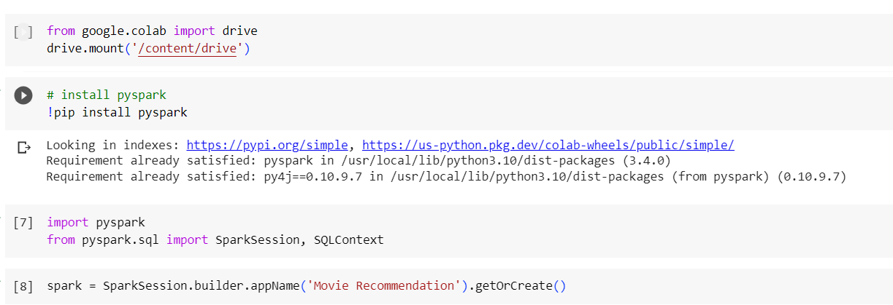

    - Selanjutnya, import library pyspark.ml, dan pyspark.sql. Kemudian read file <code>ratings.dat</code> pada google drive. kemudian lakukan RDD mapping.

        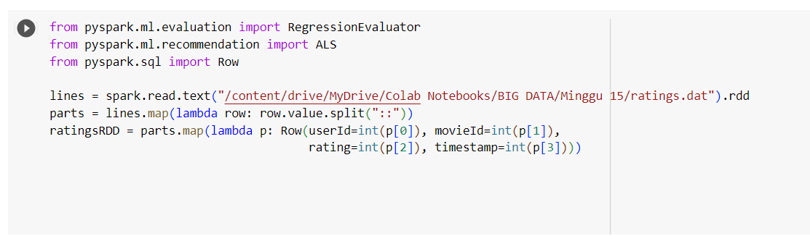

     - Membuat model rekomendasi menggunakan ALS pada training data yang telah dibuat sebelumnya.

        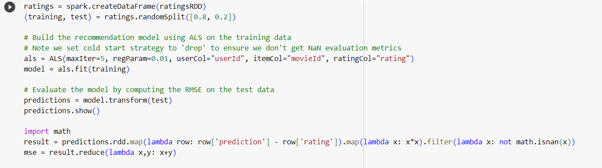

    - output :

        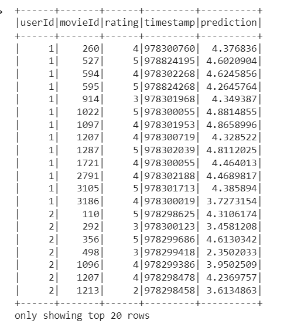

2. Praktikum Slide 48

    - Load textFile <code>Ratings.dat</code> kemudian parallelize variable myData dan mapping file yg telah di load. Kemudian train totalRatings menggunakan metode ALS untuk mendapatkan rekomendasi produk.

        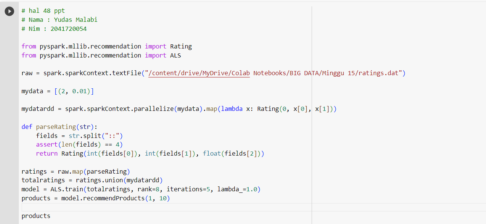

3. Praktikum Slide 49

    - Menampilkan statistik summary mulai dari rata", varian, dll dari vectorRdd rating yang telah di proses sebelumnya 

        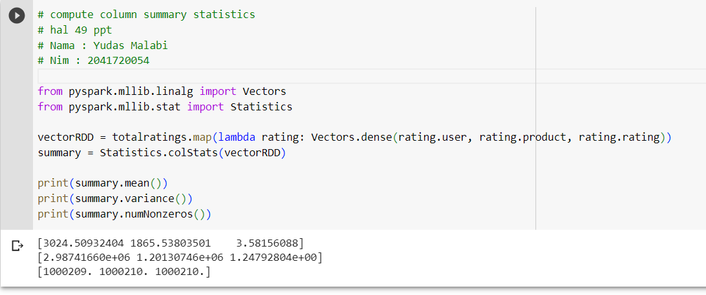

4. Praktikum Slide 52

    - Import library ml KMeans dan Vectors. kemudian load kmeans_data.txt . Selanjutnya mapping dataset dan konversi menjadi dari RDD menjadi DataFrame

    - masukkan variable parsedData pada method kmeans.fit 

        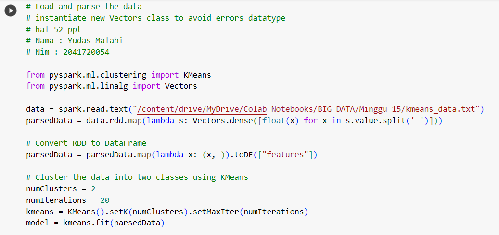

    - Menampilkan summary dari training cost dan prediksi cluster tiap data. 

        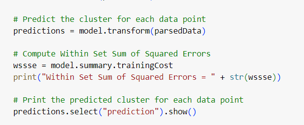

    - output : 

        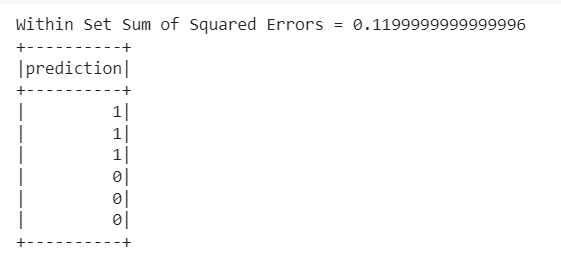

4. Praktikum Slide 53 - 54

    - Import library Kmeans, Numpy, dan Math. Kemudian membaca file kmeans_data.txt setelah itu melakukan mapping dengan patokan tiap data dipisahkan menggunakan delimiter spasi .

    - kemudian training data dengan Kmeans. dengan jumlah kluster 2 dan maksimal iterasi 10

        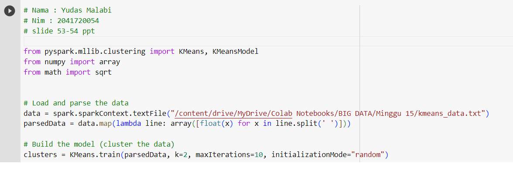

    - Menghitung WSSE dari parsedData kemudian melakukan saving model pada folder <code>ml_path_yudas</code>.

        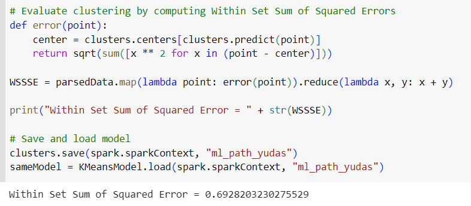

    - Jika dilihat pada sidebar, maka akan terbentuk file clusters yang telah disimpan pada folder <code>ml_path_yudas</code>

        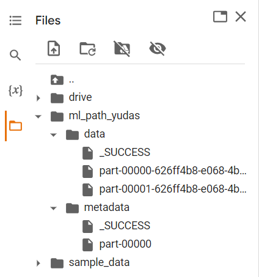